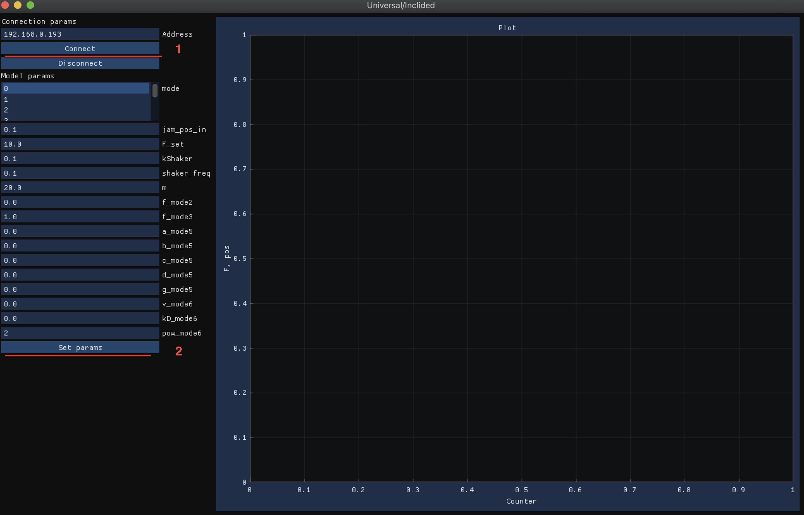

# Тестирование клиентского ПО
На машинах скачено нужно ПО, необходимо провероить что изменение параметров на клиенте изменяет параметры на сервере (на тренажере).

Для проверки требуется: <br>
Открыть терминал <br>
Проверить что машина тренажера пингуется:
```bash
ping 192.168.0.193
```
(количество отправленных и полученных пакетов совпадает, ошибок нету, если пинга нету отключить все сетевые интрефейсы кроме тренажера)<br>
Далее перейти в папку проекта:
```bash
cd Desktop/em_modules_cst
```
Скачать последнюю версию кода:
```bash
git pull
```
Активировать виртуальное окружение:
```bash
. env/bin/activate
```
Запустить программу. Для универсального/наклонного тренажера:
```bash
python main.py
```
Для вело тренажера:
```bash
python velo.py
```
Для гребного тренажера:
```bash
python rowing.py
```
После запуска нажать кнопку Connect (1 на картинке)<br>
График справа начала двигаться - есть подключение<br>
Попробовать изменить параметры в интерфейсе(меняем значения в полях - нажимаем Set params) и убедиться что на тренажере они также изменяются (2 на картинке)
